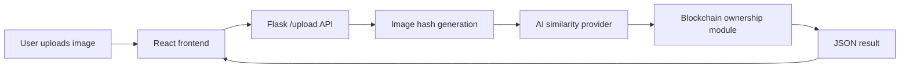

# System Architecture

## Components

- Frontend: React and Vite.
- Backend: Flask API.
- Core duplicate logic: perceptual hashing through SecureMedia core adapter.
- AI similarity: Gemini, Hugging Face, or Google Vertex AI.
- Ownership layer: EVM-compatible smart contract integration with local fallback.
- Deployment: Google Cloud Run single-service container.

## High-Level Flow



## Result Shape

```json
{
  "similarity": 0.0,
  "duplicate": false,
  "owner": "Unverified",
  "blockchain_verified": false
}
```

